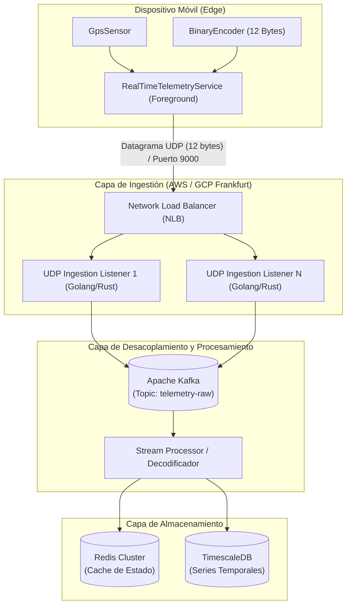
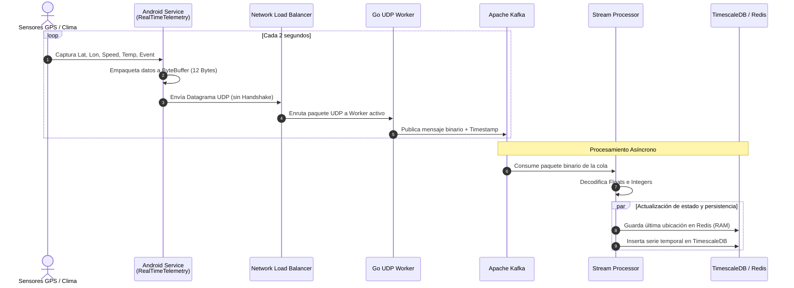

# Arquitectura del Sistema de Telemetría

## 1. Diagrama de Componentes y Flujo

```mermaid
flowchart TD
    subgraph Edge["Dispositivo Móvil (Edge)"]
        Service["RealTimeTelemetryService (Foreground)"]
        GPS["GpsSensor"] --> Service
        Encoder["BinaryEncoder (12 Bytes)"] --> Service
    end

    subgraph Ingestion["Capa de Ingestión (AWS / GCP Frankfurt)"]
        NLB["Network Load Balancer (NLB)"]
        Worker1["UDP Ingestion Listener 1 (Golang/Rust)"]
        WorkerN["UDP Ingestion Listener N (Golang/Rust)"]
        NLB --> Worker1
        NLB --> WorkerN
    end

    subgraph Messaging["Capa de Desacoplamiento y Procesamiento"]
        Kafka[("Apache Kafka\n(Topic: telemetry-raw)")]
        Processor["Stream Processor / Decodificador"]
        Kafka --> Processor
    end

    subgraph Storage["Capa de Almacenamiento"]
        Redis[("Redis Cluster\n(Cache de Estado)")]
        TSDB[("TimescaleDB\n(Series Temporales)")]
    end

    Service -- "Datagrama UDP (12 bytes) / Puerto 9000" --> NLB
    Worker1 --> Kafka
    WorkerN --> Kafka
    Processor --> Redis
    Processor --> TSDB
```

---

## 2. Diagrama de Secuencia

```mermaid
sequenceDiagram
    autonumber
    actor Sensor as Sensores GPS / Clima
    participant App as Android Service<br/>(RealTimeTelemetry)
    participant NLB as Network Load Balancer
    participant Worker as Go UDP Worker
    participant Kafka as Apache Kafka
    participant Stream as Stream Processor
    participant DB as TimescaleDB / Redis

    loop Cada 2 segundos
        Sensor->>App: Captura Lat, Lon, Speed, Temp, Event
        App->>App: Empaqueta datos a ByteBuffer (12 Bytes)
        App->>NLB: Envía Datagrama UDP (sin Handshake)
        NLB->>Worker: Enruta paquete UDP a Worker activo
        Worker->>Kafka: Publica mensaje binario + Timestamp
    end

    Note over Kafka,DB: Procesamiento Asíncrono
    Kafka->>Stream: Consume paquete binario de la cola
    Stream->>Stream: Decodifica Floats e Integers
    par Actualización de estado y persistencia
        Stream->>DB: Guarda última ubicación en Redis (RAM)
        Stream->>DB: Inserta serie temporal en TimescaleDB
    end
```
